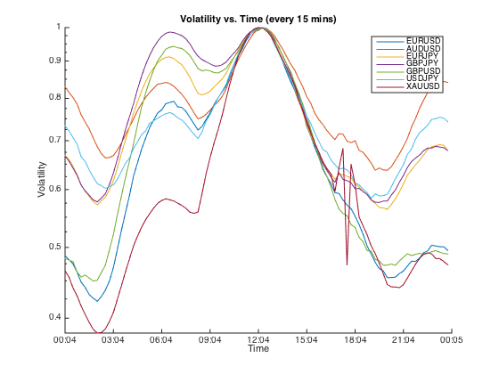
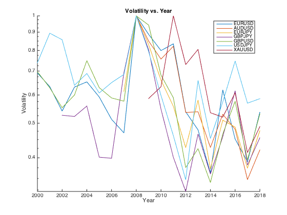
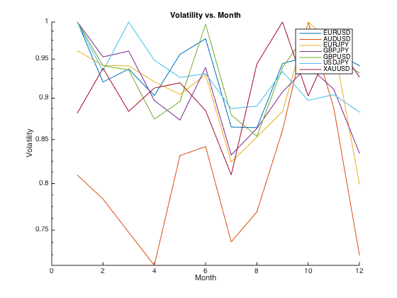

# Project name: Research on the FX market based on its volatility


Author: Peter Hsin-Yen Lee Date: 2018/4/29


## Contents

            
- Introduction        
- Part1 - Historical data processing        
- Part2 - Basic plotting        
- Part3 - Find a suitable time to start the analysis        
- Part4 - Pattern recognition within the study time range 1        
- Part5 - Pattern recognition within the study time range 2        
- Part6 - Apply this result to the stock market

## Introduction


Forex (FX) market is the largest market in the world, and it is traded 24 hours except for weekends. The number of traders involved, and the actions taken by every central bank and commercial bank, make it notorious for its volatility. Most day traders, swing traders, and scalpers gain their profit when the market starts to move, or to have a obvious direction, instead of bouncing back and forth. So an important information for markets without trading hours and without trading volumes would be when most traders start trading, and this can be measured by the volatility. There are some statistical indicators, for example, the Bollinger band, measuring the volatility of the market, and most of the strategies focus on confirming the breakouts and determine the entry point. It is acted as a supporting indicator, and is suggested that we combine this with other major indicators to build a trading system. However, the volatility in the FX market does provide us some interesting facts on different time frames. The project starts from the analysis of volatility, looks for some statistical facts based on different currency pairs in different time frames, and further finds patterns within each time. The following code analyze six currency pairs (EURUSD, AUDUSD, EURJPY, GBPJPY, GBPUSD, USDJPY) and XAUUSD, which is the price of gold. All these data, except for AUDUSD, contain the 1-min price starting from 2000/1/1. Data of every 15 mins is extracted, and calculations of moving average and moving standard deviation are made. Some plots are drawn with some notes taken. For further work, a pattern recognition at certain volatility values to find similarities in particular currency pairs. This can further be applied to the stock market, but the time frame needs to be adjusted, and this is also considered as a future project.


## Part1 - Historical data processing


EURUSD Loading files and processing them take quite a long time. Check if the .mat files are stored in the working directory. If yes, load them. If not, start from scratch.


```matlab
if exist('EURUSD.mat', 'file') == 2
    load('EURUSD.mat');
else
    % load the .csv file into matlab as a table
    eurusd = readtable('DAT_MT_EURUSD_M1.csv');
    % Rename each column
    eurusd.Properties.VariableNames = {'Date', 'Time', 'Open', 'High', 'Low', 'Close', 'Volume'};

    % First 6 rows of table eurusd
    eurusd(1:6, :)

    % Extract time variables for future analysis
    eurusd.Year = year(datetime(eurusd.Date, 'InputFormat', 'yyyy.MM.dd'));
    eurusd.Month = month(datetime(eurusd.Date, 'InputFormat', 'yyyy.MM.dd'));
    eurusd.Day = day(datetime(eurusd.Date, 'InputFormat', 'yyyy.MM.dd'));
    eurusd.Hour = hour(datetime(eurusd.Time, 'InputFormat', 'HH:mm'));
    eurusd.Minute = minute(datetime(eurusd.Time, 'InputFormat', 'HH:mm'));

    % Construct a new table
    eurusd2 = table;
    % Extract only 15 min data: only the close price is needed for now.
    eurusd2 = eurusd(mod(eurusd.Minute, 15) == 0, :);
    % Moving average calculation (Period = 20).
    eurusd2.MA = movmean(eurusd2.Close, [19, 0]);
    % Moving standard deviation calculation (Period = 20).
    eurusd2.STD = movstd(eurusd2.Close, [19, 0]);
    % Create a upper and lower band based on the standard deviation.
    % This is known as the Bollinger Band,
    % a good quantity to study volatility.
    eurusd2.UP = eurusd2.MA + 2 * eurusd2.STD;
    eurusd2.LO = eurusd2.MA - 2 * eurusd2.STD;
    % The definition of the volatility used in this project.
    eurusd2.VA = (eurusd2.UP - eurusd2.LO) * 100;

    % First 6 rows of table eurusd2
    eurusd2(1:6, :)
end

% Group this table based on Time, and calculate its average volatility.
func1 = @(x) mean(x);
eurusd_grp = varfun(func1, eurusd2, 'GroupingVariables', 'Time', 'InputVariables', 'VA');
eurusd_grp.Time2 = datetime(eurusd_grp.Time, 'InputFormat', 'HH:mm', 'Format', 'HH:mm');

% First 6 rows of table eurusd_grp
eurusd_grp(1:6, :)

% Group based on Year, Month, and Day
eurusd_grp2 = varfun(func1, eurusd2, 'GroupingVariables', 'Year', 'InputVariables', 'VA');
% First 6 rows of table eurusd_grp2
eurusd_grp2(1:6, :)

eurusd_grp3 = varfun(func1, eurusd2, 'GroupingVariables', 'Month', 'InputVariables', 'VA');
% First 6 rows of table eurusd_grp3
eurusd_grp3(1:6, :)

eurusd_grp4 = varfun(func1, eurusd2, 'GroupingVariables', 'Day', 'InputVariables', 'VA');
% First 6 rows of table eurusd_grp4
eurusd_grp4(1:6, :)
```


```
ans = 
              Time      GroupCount         Fun_VA          Time2
             _______    __________    _________________    _____
    00:00    '00:00'    3704           0.35823926188266    00:00
    00:15    '00:15'    3705          0.353423708479507    00:15
    00:30    '00:30'    3702          0.348766001675691    00:30
    00:45    '00:45'    3747          0.339703097400465    00:45
    01:00    '01:00'    3968          0.329298728019228    01:00
    01:15    '01:15'    3909          0.323992590742343    01:15
ans = 
            Year    GroupCount         Fun_VA      
            ____    __________    _________________
    2000    2000     9482         0.547362219452159
    2001    2001    15450         0.500924340801255
    2002    2002    14349         0.427990868379152
    2003    2003    21161         0.499710794387327
    2004    2004    22000         0.516673982759544
    2005    2005    21165         0.468883169183415
ans = 
         Month    GroupCount         Fun_VA      
         _____    __________    _________________
    1    1        33439         0.519572376047473
    2    2        30088         0.478227366762135
    3    3        32601         0.486843322995697
    4    4        31106         0.469354344417856
    5    5        31846         0.496820439446947
    6    6        32173          0.50768912412156
ans = 
         Day    GroupCount         Fun_VA      
         ___    __________    _________________
    1    1      11964         0.475191375934434
    2    2      12840         0.482981126775172
    3    3      12851         0.510366981881749
    4    4      12780         0.484359235782164
    5    5      13098         0.489313094021417
    6    6      13029         0.493388488428365

```


AUDUSD This is the same process.


```matlab
if exist('AUDUSD.mat', 'file') == 2
    load('AUDUSD.mat');
else
    audusd = readtable('DAT_MT_AUDUSD_M1.csv');
    audusd.Properties.VariableNames = {'Date', 'Time', 'Open', 'High', 'Low', 'Close', 'Volume'};

    audusd.Year = year(datetime(audusd.Date, 'InputFormat', 'yyyy.MM.dd'));
    audusd.Month = month(datetime(audusd.Date, 'InputFormat', 'yyyy.MM.dd'));
    audusd.Day = day(datetime(audusd.Date, 'InputFormat', 'yyyy.MM.dd'));
    audusd.Hour = hour(datetime(audusd.Time, 'InputFormat', 'HH:mm'));
    audusd.Minute = minute(datetime(audusd.Time, 'InputFormat', 'HH:mm'));

    audusd2 = table;
    audusd2 = audusd(mod(audusd.Minute, 15) == 0, :);
    audusd2.MA = movmean(audusd2.Close, [19, 0]);
    audusd2.STD = movstd(audusd2.Close, [19, 0]);
    audusd2.UP = audusd2.MA + 2 * audusd2.STD;
    audusd2.LO = audusd2.MA - 2 * audusd2.STD;
    audusd2.VA = (audusd2.UP - audusd2.LO) * 100;
end

func1 = @(x) mean(x);
audusd_grp = varfun(func1, audusd2, 'GroupingVariables', 'Time', 'InputVariables', 'VA');
audusd_grp.Time2 = datetime(audusd_grp.Time, 'InputFormat', 'HH:mm', 'Format', 'HH:mm');

audusd_grp2 = varfun(func1, audusd2, 'GroupingVariables', 'Year', 'InputVariables', 'VA');
audusd_grp3 = varfun(func1, audusd2, 'GroupingVariables', 'Month', 'InputVariables', 'VA');
audusd_grp4 = varfun(func1, audusd2, 'GroupingVariables', 'Day', 'InputVariables', 'VA');
```


EURJPY


```matlab
if exist('EURJPY.mat', 'file') == 2
    load('EURJPY.mat');
else
    eurjpy = readtable('DAT_MT_EURJPY_M1.csv');
    eurjpy.Properties.VariableNames = {'Date', 'Time', 'Open', 'High', 'Low', 'Close', 'Volume'};

    eurjpy.Year = year(datetime(eurjpy.Date, 'InputFormat', 'yyyy.MM.dd'));
    eurjpy.Month = month(datetime(eurjpy.Date, 'InputFormat', 'yyyy.MM.dd'));
    eurjpy.Day = day(datetime(eurjpy.Date, 'InputFormat', 'yyyy.MM.dd'));
    eurjpy.Hour = hour(datetime(eurjpy.Time, 'InputFormat', 'HH:mm'));
    eurjpy.Minute = minute(datetime(eurjpy.Time, 'InputFormat', 'HH:mm'));

    eurjpy2 = table;
    eurjpy2 = eurjpy(mod(eurjpy.Minute, 15) == 0, :);
    eurjpy2.MA = movmean(eurjpy2.Close, [19, 0]);
    eurjpy2.STD = movstd(eurjpy2.Close, [19, 0]);
    eurjpy2.UP = eurjpy2.MA + 2 * eurjpy2.STD;
    eurjpy2.LO = eurjpy2.MA - 2 * eurjpy2.STD;
    eurjpy2.VA = (eurjpy2.UP - eurjpy2.LO) * 100;
end

func1 = @(x) mean(x);
eurjpy_grp = varfun(func1, eurjpy2, 'GroupingVariables', 'Time', 'InputVariables', 'VA');
eurjpy_grp.Time2 = datetime(eurjpy_grp.Time, 'InputFormat', 'HH:mm', 'Format', 'HH:mm');

eurjpy_grp2 = varfun(func1, eurjpy2, 'GroupingVariables', 'Year', 'InputVariables', 'VA');
eurjpy_grp3 = varfun(func1, eurjpy2, 'GroupingVariables', 'Month', 'InputVariables', 'VA');
eurjpy_grp4 = varfun(func1, eurjpy2, 'GroupingVariables', 'Day', 'InputVariables', 'VA');
```


GBPJPY


```matlab
if exist('GBPJPY.mat', 'file') == 2
    load('GBPJPY.mat');
else
    gbpjpy = readtable('DAT_MT_GBPJPY_M1.csv');
    gbpjpy.Properties.VariableNames = {'Date', 'Time', 'Open', 'High', 'Low', 'Close', 'Volume'};

    gbpjpy.Year = year(datetime(gbpjpy.Date, 'InputFormat', 'yyyy.MM.dd'));
    gbpjpy.Month = month(datetime(gbpjpy.Date, 'InputFormat', 'yyyy.MM.dd'));
    gbpjpy.Day = day(datetime(gbpjpy.Date, 'InputFormat', 'yyyy.MM.dd'));
    gbpjpy.Hour = hour(datetime(gbpjpy.Time, 'InputFormat', 'HH:mm'));
    gbpjpy.Minute = minute(datetime(gbpjpy.Time, 'InputFormat', 'HH:mm'));

    gbpjpy2 = table;
    gbpjpy2 = gbpjpy(mod(gbpjpy.Minute, 15) == 0, :);
    gbpjpy2.MA = movmean(gbpjpy2.Close, [19, 0]);
    gbpjpy2.STD = movstd(gbpjpy2.Close, [19, 0]);
    gbpjpy2.UP = gbpjpy2.MA + 2 * gbpjpy2.STD;
    gbpjpy2.LO = gbpjpy2.MA - 2 * gbpjpy2.STD;
    gbpjpy2.VA = (gbpjpy2.UP - gbpjpy2.LO) * 100;
end

func1 = @(x) mean(x);
gbpjpy_grp = varfun(func1, gbpjpy2, 'GroupingVariables', 'Time', 'InputVariables', 'VA');
gbpjpy_grp.Time2 = datetime(gbpjpy_grp.Time, 'InputFormat', 'HH:mm', 'Format', 'HH:mm');

gbpjpy_grp2 = varfun(func1, gbpjpy2, 'GroupingVariables', 'Year', 'InputVariables', 'VA');
gbpjpy_grp3 = varfun(func1, gbpjpy2, 'GroupingVariables', 'Month', 'InputVariables', 'VA');
gbpjpy_grp4 = varfun(func1, gbpjpy2, 'GroupingVariables', 'Day', 'InputVariables', 'VA');
```


GBPUSD


```matlab
if exist('GBPUSD.mat', 'file') == 2
    load('GBPUSD.mat');
else
    gbpusd = readtable('DAT_MT_GBPUSD_M1.csv');
    gbpusd.Properties.VariableNames = {'Date', 'Time', 'Open', 'High', 'Low', 'Close', 'Volume'};

    gbpusd.Year = year(datetime(gbpusd.Date, 'InputFormat', 'yyyy.MM.dd'));
    gbpusd.Month = month(datetime(gbpusd.Date, 'InputFormat', 'yyyy.MM.dd'));
    gbpusd.Day = day(datetime(gbpusd.Date, 'InputFormat', 'yyyy.MM.dd'));
    gbpusd.Hour = hour(datetime(gbpusd.Time, 'InputFormat', 'HH:mm'));
    gbpusd.Minute = minute(datetime(gbpusd.Time, 'InputFormat', 'HH:mm'));

    gbpusd2 = table;
    gbpusd2 = gbpusd(mod(gbpusd.Minute, 15) == 0, :);
    gbpusd2.MA = movmean(gbpusd2.Close, [19, 0]);
    gbpusd2.STD = movstd(gbpusd2.Close, [19, 0]);
    gbpusd2.UP = gbpusd2.MA + 2 * gbpusd2.STD;
    gbpusd2.LO = gbpusd2.MA - 2 * gbpusd2.STD;
    gbpusd2.VA = (gbpusd2.UP - gbpusd2.LO) * 100;
end

func1 = @(x) mean(x);
gbpusd_grp = varfun(func1, gbpusd2, 'GroupingVariables', 'Time', 'InputVariables', 'VA');
gbpusd_grp.Time2 = datetime(gbpusd_grp.Time, 'InputFormat', 'HH:mm', 'Format', 'HH:mm');

gbpusd_grp2 = varfun(func1, gbpusd2, 'GroupingVariables', 'Year', 'InputVariables', 'VA');
gbpusd_grp3 = varfun(func1, gbpusd2, 'GroupingVariables', 'Month', 'InputVariables', 'VA');
gbpusd_grp4 = varfun(func1, gbpusd2, 'GroupingVariables', 'Day', 'InputVariables', 'VA');
```


USDJPY


```matlab
if exist('USDJPY.mat', 'file') == 2
    load('USDJPY.mat');
else
    usdjpy = readtable('DAT_MT_USDJPY_M1.csv');
    usdjpy.Properties.VariableNames = {'Date', 'Time', 'Open', 'High', 'Low', 'Close', 'Volume'};

    usdjpy.Year = year(datetime(usdjpy.Date, 'InputFormat', 'yyyy.MM.dd'));
    usdjpy.Month = month(datetime(usdjpy.Date, 'InputFormat', 'yyyy.MM.dd'));
    usdjpy.Day = day(datetime(usdjpy.Date, 'InputFormat', 'yyyy.MM.dd'));
    usdjpy.Hour = hour(datetime(usdjpy.Time, 'InputFormat', 'HH:mm'));
    usdjpy.Minute = minute(datetime(usdjpy.Time, 'InputFormat', 'HH:mm'));

    usdjpy2 = table;
    usdjpy2 = usdjpy(mod(usdjpy.Minute, 15) == 0, :);
    usdjpy2.MA = movmean(usdjpy2.Close, [19, 0]);
    usdjpy2.STD = movstd(usdjpy2.Close, [19, 0]);
    usdjpy2.UP = usdjpy2.MA + 2 * usdjpy2.STD;
    usdjpy2.LO = usdjpy2.MA - 2 * usdjpy2.STD;
    usdjpy2.VA = (usdjpy2.UP - usdjpy2.LO) * 100;
end

func1 = @(x) mean(x);
usdjpy_grp = varfun(func1, usdjpy2, 'GroupingVariables', 'Time', 'InputVariables', 'VA');
usdjpy_grp.Time2 = datetime(usdjpy_grp.Time, 'InputFormat', 'HH:mm', 'Format', 'HH:mm');

usdjpy_grp2 = varfun(func1, usdjpy2, 'GroupingVariables', 'Year', 'InputVariables', 'VA');
usdjpy_grp3 = varfun(func1, usdjpy2, 'GroupingVariables', 'Month', 'InputVariables', 'VA');
usdjpy_grp4 = varfun(func1, usdjpy2, 'GroupingVariables', 'Day', 'InputVariables', 'VA');
```


XAUUSD


```matlab
if exist('XAUUSD.mat', 'file') == 2
    load('XAUUSD.mat');
else
    xauusd = readtable('DAT_MT_XAUUSD_M1.csv');
    xauusd.Properties.VariableNames = {'Date', 'Time', 'Open', 'High', 'Low', 'Close', 'Volume'};

    xauusd.Year = year(datetime(xauusd.Date, 'InputFormat', 'yyyy.MM.dd'));
    xauusd.Month = month(datetime(xauusd.Date, 'InputFormat', 'yyyy.MM.dd'));
    xauusd.Day = day(datetime(xauusd.Date, 'InputFormat', 'yyyy.MM.dd'));
    xauusd.Hour = hour(datetime(xauusd.Time, 'InputFormat', 'HH:mm'));
    xauusd.Minute = minute(datetime(xauusd.Time, 'InputFormat', 'HH:mm'));

    xauusd2 = table;
    xauusd2 = xauusd(mod(xauusd.Minute, 15) == 0, :);
    xauusd2.MA = movmean(xauusd2.Close, [19, 0]);
    xauusd2.STD = movstd(xauusd2.Close, [19, 0]);
    xauusd2.UP = xauusd2.MA + 2 * xauusd2.STD;
    xauusd2.LO = xauusd2.MA - 2 * xauusd2.STD;
    xauusd2.VA = (xauusd2.UP - xauusd2.LO) * 100;
end

func1 = @(x) mean(x);
xauusd_grp = varfun(func1, xauusd2, 'GroupingVariables', 'Time', 'InputVariables', 'VA');
xauusd_grp.Time2 = datetime(xauusd_grp.Time, 'InputFormat', 'HH:mm', 'Format', 'HH:mm');

xauusd_grp2 = varfun(func1, xauusd2, 'GroupingVariables', 'Year', 'InputVariables', 'VA');
xauusd_grp3 = varfun(func1, xauusd2, 'GroupingVariables', 'Month', 'InputVariables', 'VA');
xauusd_grp4 = varfun(func1, xauusd2, 'GroupingVariables', 'Day', 'InputVariables', 'VA');
```


## Part2 - Basic plotting


Notes: (1) For comparison, the maximum value of each curve has been set equal to 1. (2) The time in the x-aixs is the Eastern Standard Time (UTC-5).


```matlab
% Plot-1: Volatility vs. Time (every 15 mins)
figure
hold on;
plot(eurusd_grp.Time2, eurusd_grp.Fun_VA/max(eurusd_grp.Fun_VA))
plot(audusd_grp.Time2, audusd_grp.Fun_VA/max(audusd_grp.Fun_VA))
plot(eurjpy_grp.Time2, eurjpy_grp.Fun_VA/max(eurjpy_grp.Fun_VA))
plot(gbpjpy_grp.Time2, gbpjpy_grp.Fun_VA/max(gbpjpy_grp.Fun_VA))
plot(gbpusd_grp.Time2, gbpusd_grp.Fun_VA/max(gbpusd_grp.Fun_VA))
plot(usdjpy_grp.Time2, usdjpy_grp.Fun_VA/max(usdjpy_grp.Fun_VA))
plot(xauusd_grp.Time2, xauusd_grp.Fun_VA/max(xauusd_grp.Fun_VA))

datetick('x', 'HH:mm')
title('Volatility vs. Time (every 15 mins)');
xlabel('Time');
ylabel('Volatility');
set(gca, 'YScale', 'log');
legend('EURUSD', 'AUDUSD', 'EURJPY', 'GBPJPY', 'GBPUSD', 'USDJPY', 'XAUUSD');
%line([datetime('00:15', 'InputFormat', 'HH:mm'), datetime('23:45', 'InputFormat', 'HH:mm')], [0.5, 0.5], 'LineStyle', '--');
hold off;

% Some quick observations from this figure:
% (1) From this figure, there exists three peaks: one minor peak for the Asian
% session, the other two correspond to the European session and the US
% session.
% (2) Currency pairs related to AUD and JPY are more volatile than others
% in Asian session. and currency pair related to GBP are more volatile in
% the European session, which is a reasonable fact.
% (3) All currency pairs appears to have the same peak volatilities, at
% around 12:30 pm.
% (4) Surprisingly, gold (XAU) has the lowest volatility in the Asian and
% the European sessions, compared to other currency pairs.
% (5) The best time for traders to activate their trading strategies would
% be 2:15 am EST.
```





```matlab
% Plot-2: Volatility vs. Year
figure
hold on;
plot(eurusd_grp2.Year, eurusd_grp2.Fun_VA/max(eurusd_grp2.Fun_VA))
plot(audusd_grp2.Year, audusd_grp2.Fun_VA/max(audusd_grp2.Fun_VA))
plot(eurjpy_grp2.Year, eurjpy_grp2.Fun_VA/max(eurjpy_grp2.Fun_VA))
plot(gbpjpy_grp2.Year, gbpjpy_grp2.Fun_VA/max(gbpjpy_grp2.Fun_VA))
plot(gbpusd_grp2.Year, gbpusd_grp2.Fun_VA/max(gbpusd_grp2.Fun_VA))
plot(usdjpy_grp2.Year, usdjpy_grp2.Fun_VA/max(usdjpy_grp2.Fun_VA))
plot(xauusd_grp2.Year, xauusd_grp2.Fun_VA/max(xauusd_grp2.Fun_VA))
set(gca, 'YScale', 'log');
legend('EURUSD', 'AUDUSD', 'EURJPY', 'GBPJPY', 'GBPUSD', 'USDJPY', 'XAUUSD');
%line([datetime('00:15', 'InputFormat', 'HH:mm'), datetime('23:45', 'InputFormat', 'HH:mm')], [0.5, 0.5], 'LineStyle', '--');
title('Volatility vs. Year');
xlabel('Year');
ylabel('Volatility');
hold off;

% What do we see in this figure:
% (1) No doubt year 2008 was the most volitile year.
% (2) Since then, the volatility drops significantly, especially for years
% 2012, 2014, and 2017.
% (3) Gold seems to have a lagging volatility compared to others, which
% show a peak at 2011.
```




Plot-3: Volatility vs. Month


```matlab
figure
hold on;
plot(eurusd_grp3.Month, eurusd_grp3.Fun_VA/max(eurusd_grp3.Fun_VA))
plot(audusd_grp3.Month, audusd_grp3.Fun_VA/max(audusd_grp3.Fun_VA))
plot(eurjpy_grp3.Month, eurjpy_grp3.Fun_VA/max(eurjpy_grp3.Fun_VA))
plot(gbpjpy_grp3.Month, gbpjpy_grp3.Fun_VA/max(gbpjpy_grp3.Fun_VA))
plot(gbpusd_grp3.Month, gbpusd_grp3.Fun_VA/max(gbpusd_grp3.Fun_VA))
plot(usdjpy_grp3.Month, usdjpy_grp3.Fun_VA/max(usdjpy_grp3.Fun_VA))
plot(xauusd_grp3.Month, xauusd_grp3.Fun_VA/max(xauusd_grp3.Fun_VA))
set(gca, 'YScale', 'log');
title('Volatility vs. Month');
xlabel('Month');
ylabel('Volatility');
legend('EURUSD', 'AUDUSD', 'EURJPY', 'GBPJPY', 'GBPUSD', 'USDJPY', 'XAUUSD');
%line([datetime('00:15', 'InputFormat', 'HH:mm'), datetime('23:45', 'InputFormat', 'HH:mm')], [0.5, 0.5], 'LineStyle', '--');
hold off;

% What do we see in this figure:
% (1) Generally speaking, July and December are the months with the lowest
% volatility, and January, June, and October seem to have the highest.
```




Plot-4: Volatility vs. Day within a month


```matlab
figure
hold on;
plot(eurusd_grp4.Day, eurusd_grp4.Fun_VA/max(eurusd_grp4.Fun_VA))
plot(audusd_grp4.Day, audusd_grp4.Fun_VA/max(audusd_grp4.Fun_VA))
plot(eurjpy_grp4.Day, eurjpy_grp4.Fun_VA/max(eurjpy_grp4.Fun_VA))
plot(gbpjpy_grp4.Day, gbpjpy_grp4.Fun_VA/max(gbpjpy_grp4.Fun_VA))
plot(gbpusd_grp4.Day, gbpusd_grp4.Fun_VA/max(gbpusd_grp4.Fun_VA))
plot(usdjpy_grp4.Day, usdjpy_grp4.Fun_VA/max(usdjpy_grp4.Fun_VA))
plot(xauusd_grp4.Day, xauusd_grp4.Fun_VA/max(xauusd_grp4.Fun_VA))
set(gca, 'YScale', 'log');
title('Volatility vs. Day');
xlabel('Day');
ylabel('Volatility');
legend('EURUSD', 'AUDUSD', 'EURJPY', 'GBPJPY', 'GBPUSD', 'USDJPY', 'XAUUSD');
%line([datetime('00:15', 'InputFormat', 'HH:mm'), datetime('23:45', 'InputFormat', 'HH:mm')], [0.5, 0.5], 'LineStyle', '--');
hold off;

% What do we see in this figure:
% (1) The first half of the month is often more volatile than the second
% half.
```


## Part3 - Find a suitable time to start the analysis


(Needs further work)


## Part4 - Pattern recognition within the study time range 1


Using price movement (Needs further work)


## Part5 - Pattern recognition within the study time range 2


Using MACD and other technical indicators (Needs further work)


## Part6 - Apply this result to the stock market


(Needs further work)


<sub>[Published with MATLAB R2014b]("http://www.mathworks.com/products/matlab/")</sub>
